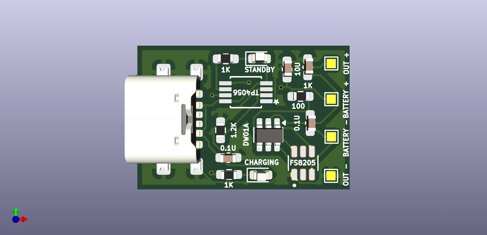
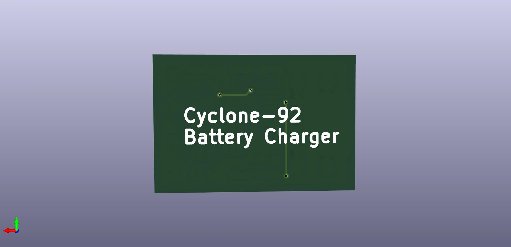
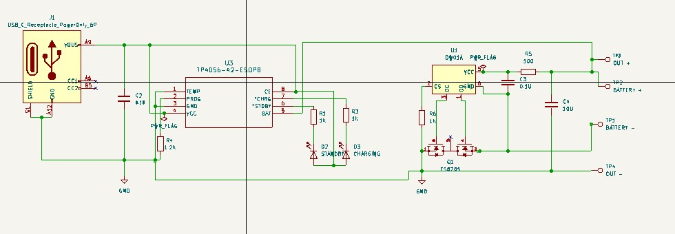

<h1 align="center">
  TP4056 with DW01 Protection Circuit
</h1>
<p align="center">
  
</p>

<div align="center">
  
[](https://opensource.org/licenses/MIT)
[](https://github.com/yourusername/tp4056-dw01/issues)
[](https://github.com/yourusername/tp4056-dw01/stargazers)

</div>

## 📝 Overview

This is a 1A lithium battery charging and protection module that combines the TP4056 linear charger IC with DW01 protection IC. Perfect for safely charging and protecting single-cell Li-ion/Li-po batteries.

## 🔍 Module Details

| Front View | Back View | Schematic Layout |
|------------|-----------|------------|
|  |  |  |

## ⚡ Features

- **Charging Capabilities**:
  - Constant current/constant voltage operation
  - Programmable charge current up to 1A
  - Thermal regulation
  - Input voltage: 4.5-5.5V
  - Full charge voltage: 4.2V ±1%

- **Protection Features** (DW01):
  - ⚠️ Overcharge protection
  - 🔋 Over-discharge protection
  - ⚡ Short circuit protection
  - 🌡️ Overcurrent protection

- **Status Indicators**:
  - 🔴 Red LED   - Charging
  - 🔵 Blue LED  - Fully charged
  - ⚫ Both OFF  - No input power
 
## 🛠️ Example Projects

<details>
<summary>Power Bank Build</summary>
  1. Components needed:
    - TP4056 module
    - 18650 battery holder
    - USB ports
    - Case
</details>

<details>
<summary>Solar Charger</summary>
  1. Components needed:
    - TP4056 module
    - Solar panel (6V)
    - Battery
</details>

## ⚠️ Safety Warnings

```diff
- Only use with 3.7V Li-ion/Li-po batteries
- Do not exceed 5.5V input voltage
- Check battery polarity before connecting
- Not compatible with LiFePO4 batteries
- Keep away from moisture and extreme temperatures
```


<div align="center">
⭐ Star this repository if you find it helpful!
</div> 
